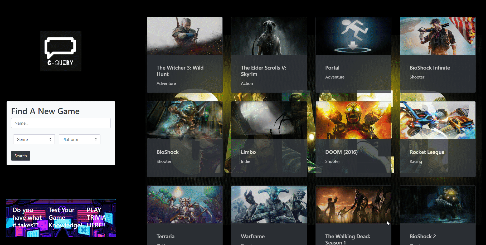

# Gamer-Q : Video Game Search Engine

## Description 

Our mission is to create an application to help gamers find their next game with ease. The gaming community is spread far and wide and it was our job to consolidate all games for the convenience of the user. With  Game-Q a user can search by genre, platform, and the game name itself. As a user you will be provided with a library of games based on your criteria giving you game ratings, infomforamtion on the game as well as a link to watch the gameplay on Youtube. Additonally we added a new feature to test your knowledge of gaming with a trivia game.


## User Story

```
As a user,
I want to open the page and either type in a name, search through a genre, or search through a platform
so that I may locate a specific game, a youtube video of that game, and aspects and ratings of said game.
Additionaly, I'd like to click on the gif under the search query, be taken to a page 
where I can test my video game knowledge, and enter my highscore once the test is finished, 
so that my friends may see how knowledgeable I am in video games.

```

## Acceptance Criteria

```
GIVEN a list of search citeria I can input
Genre, Platform and the name of the game to query
Then I am presented with cards displaying the relevant games 
When I hover over a card element 
I am present with information about the game, a button to watch a youtube video about the game
When I view a game with a rating of over 4.5
Then I am presented with a star Icon 
When I click the trivia button
Then I am taken to a new window to start the trivia game
When I press the start button
Then I am presented with a series of gaming questions with countdown
When the trivia is over I am presented with my score and a list of scores
When I view the score list 
Then I am presented with the top score in green and lowest score in red
```

## Contents

1. [Deployed Application](#deployed-application)
2. [Installation](#installation)
3. [Credits](#credits)
4. [License](#license)
5. [Links](#links)


## Deployed Application





## Installation
* N/A


## Credits

* https://getbootstrap.com/
* https://kit.fontawesome.com/731ef402c1.js
* https://opentdb.com/api_config.php
* https://rawg.io/
* https://developers.google.com/youtube/v3
* https://www.w3schools.com/
* https://stackoverflow.com/

Collaborators: Kermit and the Frogs
- [Siddharth Desai](https://github.com/shd327)
- [Garrett Anderson](https://github.com/GarrettA01)
- [Omar Yassine](https://github.com/oyassine1999)
- [Andrew LaBorde](https://github.com/AndyLaBorde)


## License

Please refer to the LICENSE in the repo.

## Links
* [Deployed Github Page](https://andylaborde.github.io/Gamer-Q/)
* [Github](https://github.com/AndyLaBorde/Gamer-Q)
