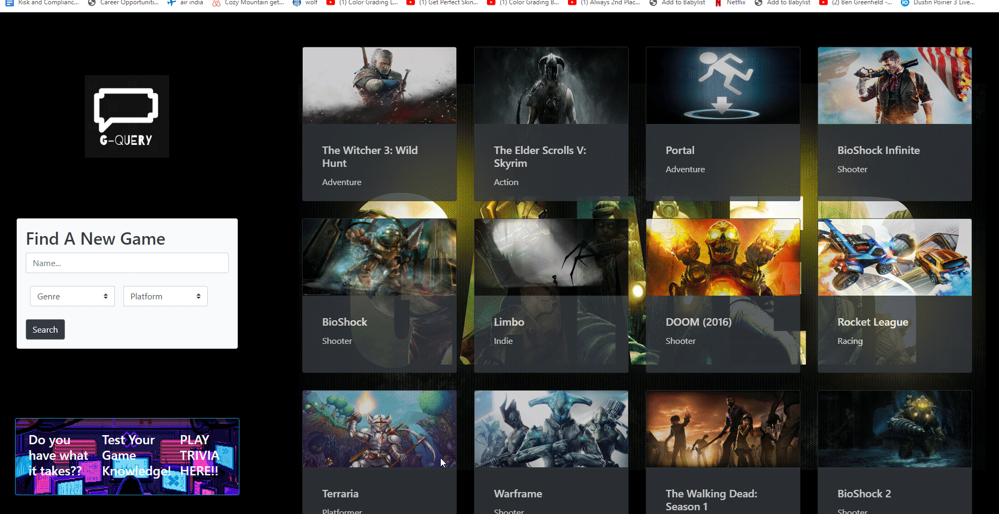

# Gamer-Q : Video Game Search Engine

## Contents

1. [User Story](#user-story)
2. [Deployed Application](#deployed-application)
3. [Credits](#credits)
4. [License](#license)

## User Story

As a user, I want to open the page and either type in a name, search through a genre, or search through a platform, so that I may locate a specific game, a youtube video of that game, and aspects and ratings of said game. Additionaly, I'd like to click on the gif under the search query, be taken to a page where I can test my video game knowledge, and enter my highscore once the test is finished, so that my friends may see how knowledgeable I am in video games.

## Deployed Application

[Deployed Github Page]

## Credits

Collaborators: Kermit and the Frogs

- Siddharth Desai
- Garrett Anderson
- Omar Yassine
- Andrew LaBorde

## License

Please refer to the LICENSE in the repo.
